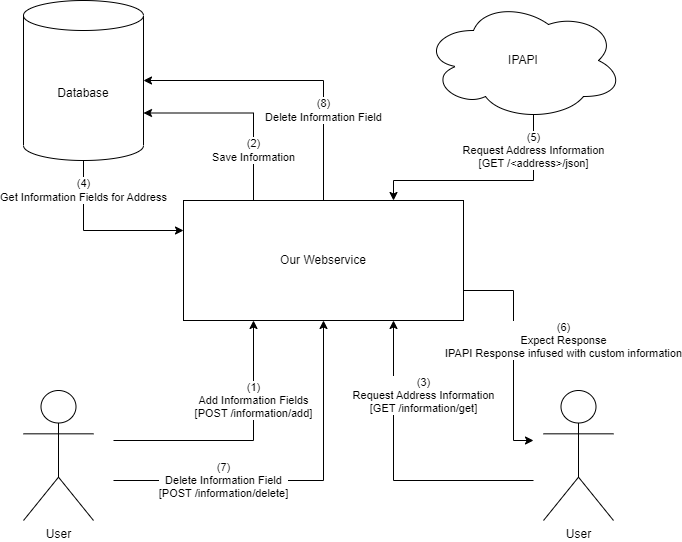

# 03. Context and Scope

## Communication: User <-> Webservice
- User requests will utilize generic HTTP parameters.
- The server will respond using JSON if the HTTP status is 200 OK.
- Reachable REST-Endpoints are:
    - `POST /information/add`
    - `DELETE /information/delete`
    - `GET /information/get`

## Communication: Webservice <-> IPAPI
- Information will be fetched using a generic GET-request with the address parameter in the URL.
- Response will always be JSON when IPAPI responds with 200 OK.
- The request may result in a 200 OK response if too many requests have been sent.
- The request will result in a 200 OK response if the address is malformed, local, reserved, etc.
  In this case, error and reason are indicated in the received JSON object.

## Communication: Webservice <-> Database
- The communication between the backend and the database will use whatever spring boot magically
  decides to use by default.
- Because this is simply a demo project, the database used is a H2 In-Memory database.

