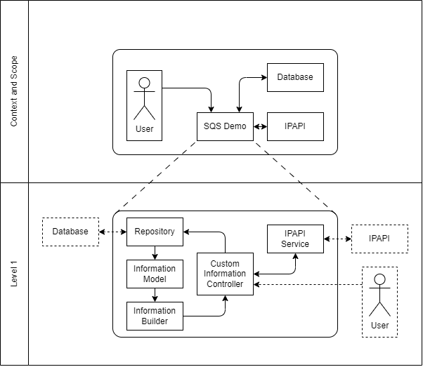

# 05. Building Block View

Described here will be the key components and their interaction within the application.
This provides an overview over the high-level structure of the system and highlights
the purpose and the relationships of the building blocks that make up the application.

## Custom Information Controller
This is the main part of the application: The API controller.
User requests arrive here and are handled in this class.
It provides the API path and parameter mapping as well as the implementation of the API endpoints.
It communicates with the repository to load, store and delete custom field information.
When fetching address information, the controller communicates with the IPAPI Service,
which in turn communicates with the actual IPAPI API.

## Repository
This is the JPA repository interface to the database.
It is extended with additional queries to fetch all fields for a single IP address
and delete a single information field.

## Information Model, Information Builder
This model stores a single information field for an IP address.
When a list of information fields is present, the Information Builder
can be used to construct a JSON-serializable list of information fields. 

## IPAPI Service
To talk to the external API, a service class is used.
This service class is wired to the Custom Information Controller and accessed every time
address information is requested. It handles HTTPS communication for API requests
and JSON response parsing.

