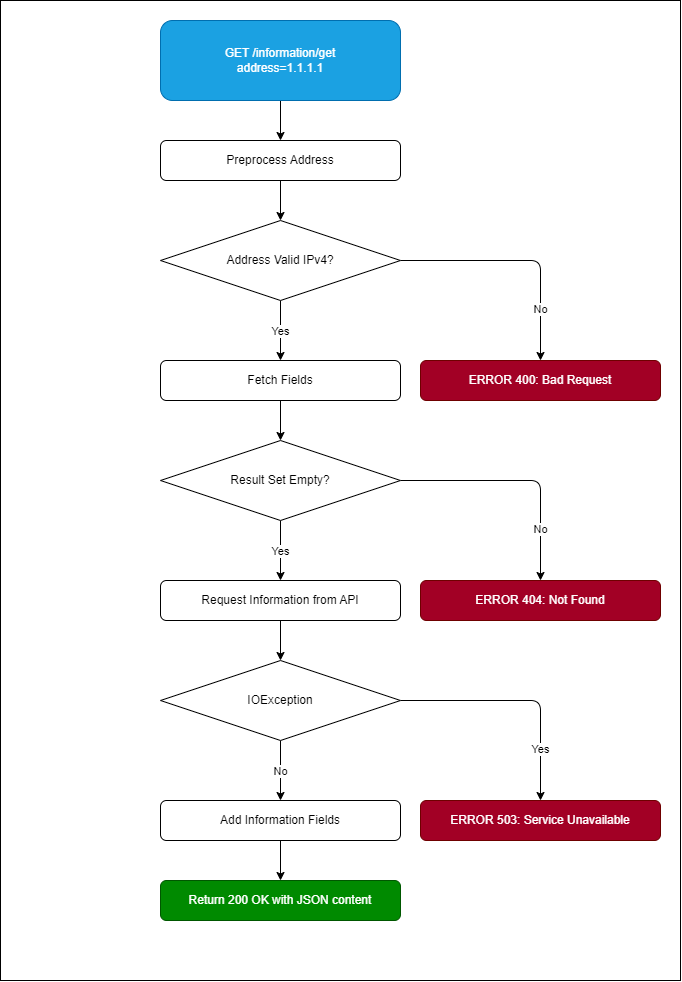

# 06. Runtime View

Described here is the flow control when executing the primary use cases.

## Adding a Custom Information Field

## Deleting a Custom Information Field

## Getting Custom Information Fields

